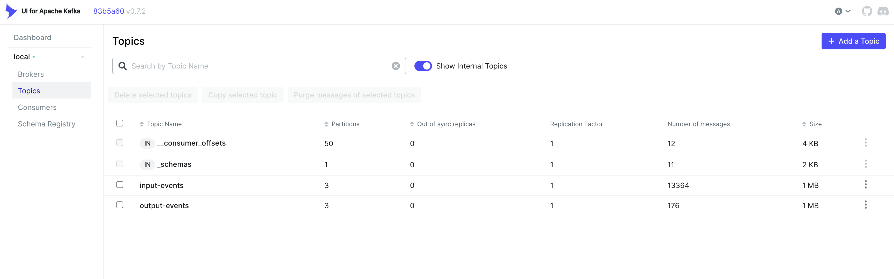
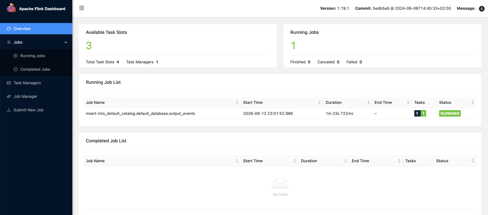
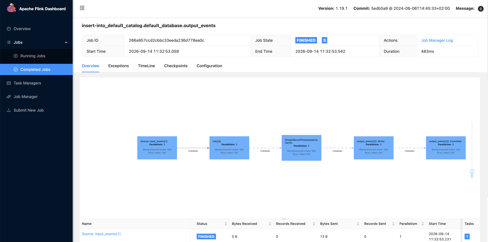
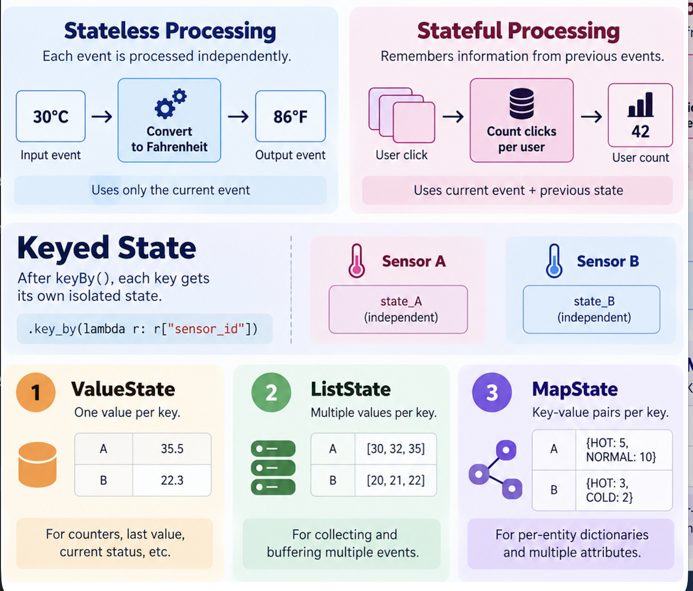

# pyflink-streaming-patterns
Practical, real-world PyFlink streaming examples with Kafka, Amazon S3, ClickHouse, and other modern data engineering technologies. Learn how to build, process, monitor, and troubleshoot production-style streaming pip

# Kafka + PyFlink Local Stack

Local dev environment: Kafka (KRaft) + Schema Registry + Kafka UI + Flink + MinIO.

## Start the stack

```bash
docker compose up -d --build
```

Services:
- Kafka UI: http://localhost:8080
- Schema Registry: http://localhost:8081
- Flink UI: http://localhost:8082
- MinIO Console: http://localhost:9001 (minioadmin / minioadmin)

## Kafka UI 





## Flink UI




## Produce sample data

```bash
python3 -m venv .venv && source .venv/bin/activate
pip install -r requirements.txt
python3 scripts/produce_sample_data.py
```

Sends Avro-encoded sensor events (registered with Schema Registry) to the `input-events` topic.

## Jobs (`flink/jobs/`)

| File | What it does |
|---|---|
| `kafka_to_minio_datastream.py` | **Recommended.** DataStream API, no SQL. Reads Kafka, decodes Avro via Schema Registry, writes JSON to MinIO using boto3. Works reliably. |
| `kafka_to_s3.py` | Table API (SQL). Reads Kafka, writes JSON to real AWS S3 via Hadoop's S3A filesystem. Needs AWS credentials in `docker-compose.yml` (see below). |
| `kafka_pyflink_job.py`, `simple_pyflink_job.py`, `tumbling_window_flink.py` | Smaller examples/experiments. |

Run any job:
```bash
docker exec jobmanager ./bin/flink run -py /opt/flink/jobs/<job>.py
```

## AWS S3 credentials (for `kafka_to_s3.py` only)

Hadoop's S3A filesystem needs the full key names, not shortcuts, when using temporary (`ASIA...`) credentials — set in `docker-compose.yml` under `jobmanager`/`taskmanager`:

```yaml
fs.s3a.access.key: <access key>
fs.s3a.secret.key: <secret key>
fs.s3a.session.token: <session token>
fs.s3a.aws.credentials.provider: org.apache.hadoop.fs.s3a.TemporaryAWSCredentialsProvider
```

After editing, recreate the containers (env vars are frozen at container creation, not hot-reloaded):
```bash
docker compose up -d --force-recreate jobmanager taskmanager
```

Temporary credentials expire — regenerate and repeat the step above when you start seeing `403 Forbidden`.


## Also included

- `simple_kafka_to_s3.py` — plain Python (no Flink) alternative: `confluent-kafka` consumer + boto3 uploader. Useful if you just want data in S3 without standing up Flink.
- `scripts/create_topics.sh` — idempotent topic creation (`input-events`, `output-events`).
- `schema/sensor_event.avsc` — Avro schema for sensor events.


### SCAN_STARTUP_MODE:

-  `earliest-offset` — reads the whole topic from the start (what it was already doing).
- `latest-offset` — ignores everything already in the topic, only sees new messages produced after the job starts.
-  `timestamp` — starts at the first message at or after SCAN_STARTUP_TIMESTAMP_MILLIS. Set that to a real millisecond timestamp (e.g. int(time.time() * 1000) for "from now", or a specific past moment).





### Stateful vs Stateless Processing in Flink




